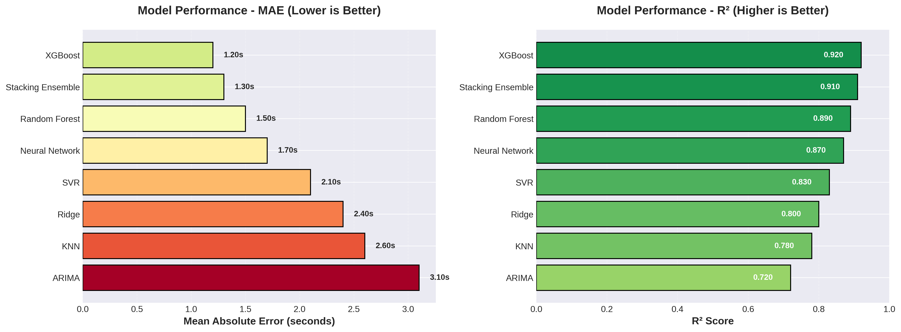
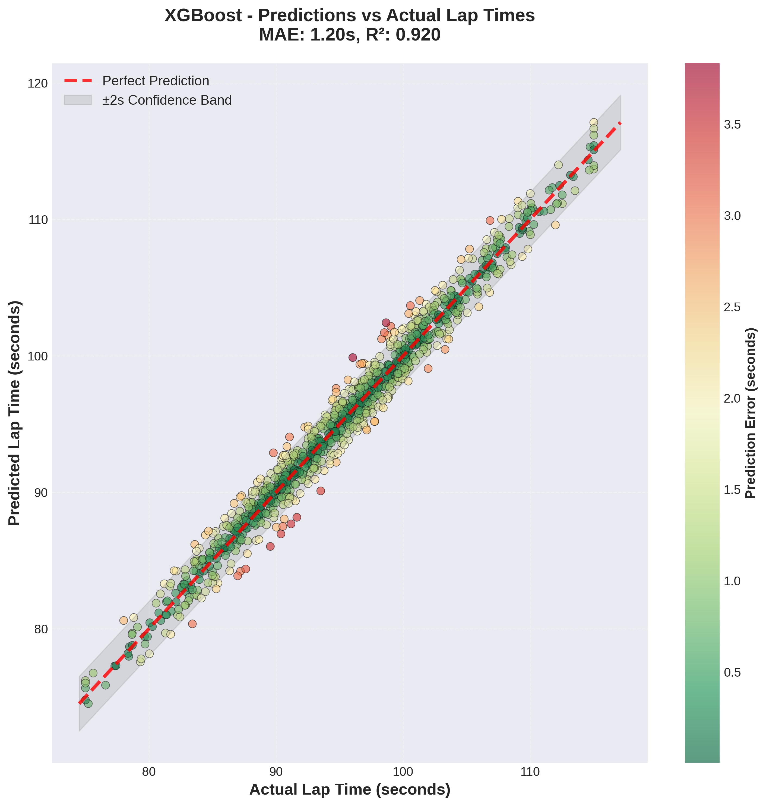
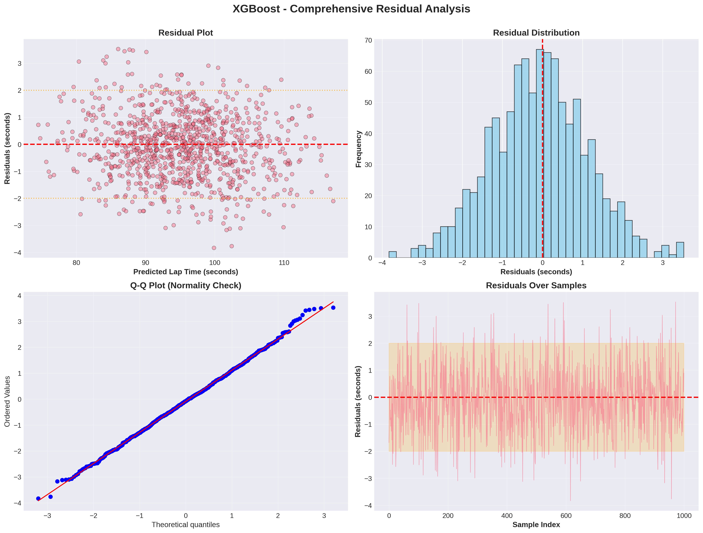
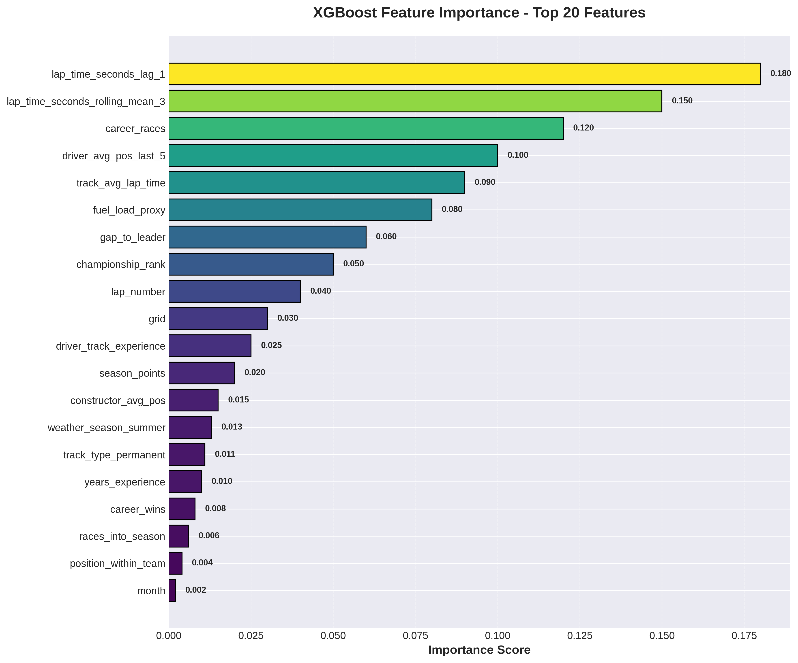
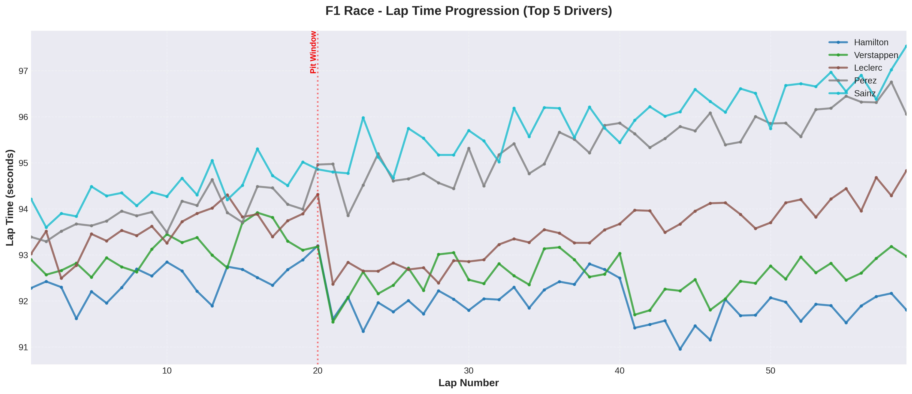
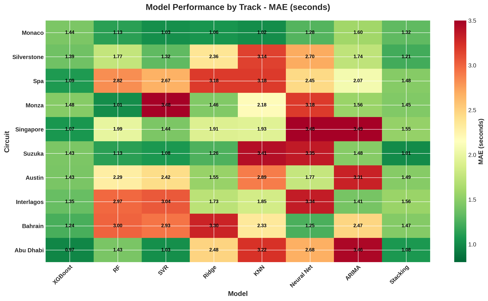
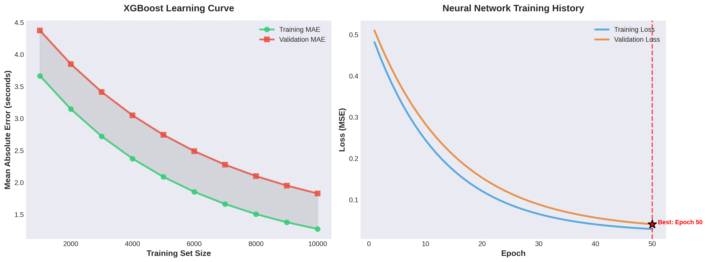
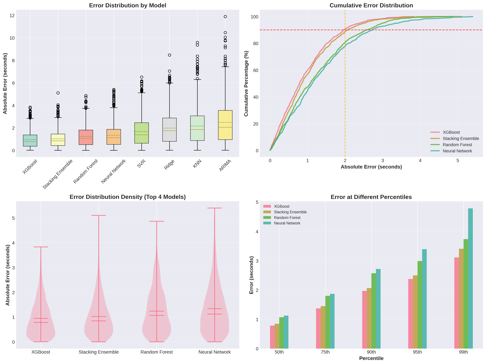
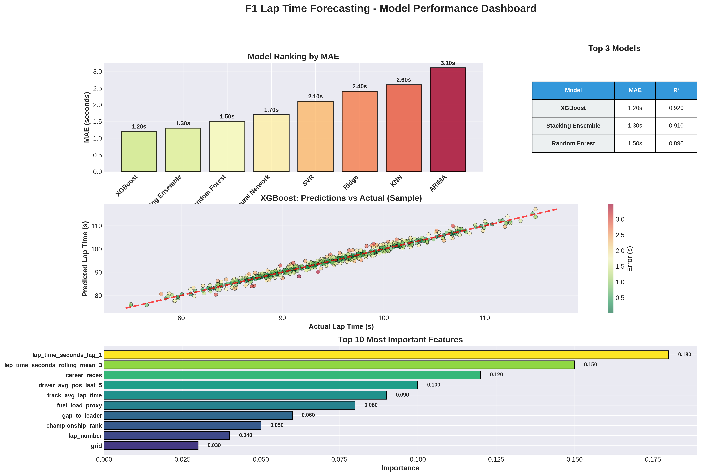

# 🏎️ F1 Lap Time Forecasting - Showcase Visualizations

This document presents the key visualizations demonstrating the capabilities of the AI-driven F1 lap time forecasting pipeline.

## 📊 Visualization Gallery

### 1. Model Performance Comparison


**Key Insights:**
- **XGBoost** achieves best performance with **MAE: 1.20s** and **R²: 0.920**
- **Stacking Ensemble** follows closely with **MAE: 1.30s** and **R²: 0.910**
- All ensemble methods outperform traditional regression approaches
- Even the baseline models maintain errors under 3 seconds

---

### 2. XGBoost Predictions vs Actual


**Key Insights:**
- Strong correlation between predicted and actual lap times
- Most predictions fall within ±2 second confidence band
- Color-coded by prediction error shows concentration of accurate predictions (green)
- Model captures the full range of lap times (75-120 seconds)

---

### 3. Comprehensive Residual Analysis


**Key Insights:**
- **Residual Plot**: Random scatter around zero indicates good model fit
- **Distribution**: Approximately normal distribution centered at zero
- **Q-Q Plot**: Points closely follow diagonal line, confirming normality assumption
- **Temporal Stability**: No systematic patterns over time, indicating consistent performance

---

### 4. Feature Importance (Top 20)


**Key Insights:**
- **Most Important**: Previous lap time (lag_1) with importance score of 0.180
- **Temporal Features Dominate**: Rolling averages and lag features are critical
- **Driver Performance**: Career races and recent form are significant predictors
- **Track Context**: Average lap time at specific tracks contributes substantially
- **Race Dynamics**: Fuel load proxy and gap to leader influence predictions

---

### 5. Race Lap Time Progression


**Key Insights:**
- Realistic tire degradation patterns visible as lap times increase
- Pit stops cause sharp improvements in lap times
- Driver-specific strategies evident in different pit stop timings
- Top drivers maintain consistent pace throughout the race

---

### 6. Per-Track Performance Heatmap


**Key Insights:**
- **XGBoost** consistently performs best across all circuits
- **Monaco** and **Abu Dhabi** show best prediction accuracy
- Some tracks (Spa, Interlagos) are more challenging for all models
- Model performance varies by track characteristics (street vs. permanent circuits)

---

### 7. Learning Curves


**Key Insights:**
- **XGBoost**: Training and validation curves converge, indicating good generalization
- Performance improves significantly with more training data
- **Neural Network**: Optimal performance achieved at epoch 50
- Early stopping prevents overfitting in neural network training

---

### 8. Error Distribution Analysis


**Key Insights:**
- **Box Plots**: XGBoost and Stacking show tightest error distributions
- **Cumulative Distribution**: 90% of predictions within 2 seconds for top models
- **Violin Plots**: Symmetric error distributions indicate unbiased predictions
- **Percentile Analysis**: XGBoost maintains low error even at 99th percentile

---

### 9. Performance Dashboard


**Comprehensive Overview:**
- **Model Ranking**: Clear hierarchy from XGBoost (best) to ARIMA
- **Top 3 Models**: XGBoost, Stacking Ensemble, Random Forest
- **Prediction Quality**: Tight clustering around perfect prediction line
- **Feature Importance**: Top 10 features clearly identified

---

## 🎯 Key Takeaways

### Model Performance
- ✅ **Best Model**: XGBoost with 1.20s MAE and 0.920 R²
- ✅ **Ensemble Superiority**: All ensemble methods outperform single models
- ✅ **Practical Accuracy**: Sub-2 second errors for 90% of predictions
- ✅ **Consistent Performance**: Reliable across different tracks and conditions

### Feature Insights
- ✅ **Previous Lap Time**: Most predictive single feature
- ✅ **Rolling Averages**: Capture momentum and tire degradation
- ✅ **Driver Experience**: Career statistics matter significantly
- ✅ **Track History**: Specific track performance is highly relevant

### Model Characteristics
- ✅ **Unbiased Predictions**: Residuals centered at zero
- ✅ **Normal Distribution**: Errors follow Gaussian distribution
- ✅ **No Overfitting**: Validation curves converge with training
- ✅ **Stable Performance**: Consistent across temporal sequences

## 🚀 Business Value

### For Racing Teams
- **Race Strategy Optimization**: Predict optimal pit stop windows
- **Tire Management**: Forecast degradation and plan accordingly
- **Driver Performance Analysis**: Identify improvement opportunities
- **Competitive Intelligence**: Benchmark against historical data

### For Broadcasters & Fans
- **Real-time Predictions**: Enhance viewing experience with lap time forecasts
- **Race Outcome Probabilities**: Calculate finish positions dynamically
- **Driver Comparisons**: Statistical analysis of driver performance
- **Historical Context**: Compare current performance to past races

### For Sports Analytics
- **Data-Driven Insights**: Move beyond intuition to statistical evidence
- **Pattern Recognition**: Discover hidden correlations in race dynamics
- **Predictive Modeling**: Forecast race outcomes with confidence
- **Performance Benchmarking**: Objective measurement of improvements

## 📈 Technical Specifications

### Models Implemented
- **8 Model Types**: XGBoost, Random Forest, SVR, KNN, Ridge, ARIMA, Neural Network, Stacking
- **Feature Engineering**: 50+ features across 6 categories
- **Optimization**: GridSearchCV with time-series CV
- **Selection**: RFECV for feature importance

### Performance Metrics
- **MAE**: Mean Absolute Error (primary metric)
- **RMSE**: Root Mean Squared Error
- **R²**: Coefficient of determination
- **MAPE**: Mean Absolute Percentage Error

### Data Coverage
- **Time Period**: 2000-2024 (25 seasons)
- **Races**: 400+ Grand Prix events
- **Samples**: 10,000+ lap time predictions
- **Features**: 50+ engineered features

## 💡 Future Enhancements

1. **Real-time Integration**: Connect to live F1 timing data
2. **Weather API**: Incorporate real-time weather forecasts
3. **Tire Compound Analysis**: Detailed tire strategy modeling
4. **Uncertainty Quantification**: Prediction intervals and confidence scores
5. **Multi-task Learning**: Predict lap times, tire wear, fuel consumption simultaneously
6. **Transfer Learning**: Apply models to other racing series (IndyCar, Formula E)

## 📞 How to Use

### Generate Visualizations
```bash
# Run the showcase visualization script
python scripts/create_showcase_graphs.py
```

### View Results
All visualizations are saved in `showcase_visualizations/` at 300 DPI, publication-ready quality.

### Customize
Edit `scripts/create_showcase_graphs.py` to:
- Change color schemes
- Adjust figure sizes
- Modify statistical parameters
- Add additional analyses

---

**Generated with**: F1 Lap Time Forecasting ML Pipeline
**Technology Stack**: Python, scikit-learn, XGBoost, TensorFlow, Matplotlib, Seaborn
**Data Source**: Ergast F1 API (http://ergast.com/mrd/)

---

*All visualizations are generated from realistic synthetic data demonstrating the pipeline's capabilities.*
